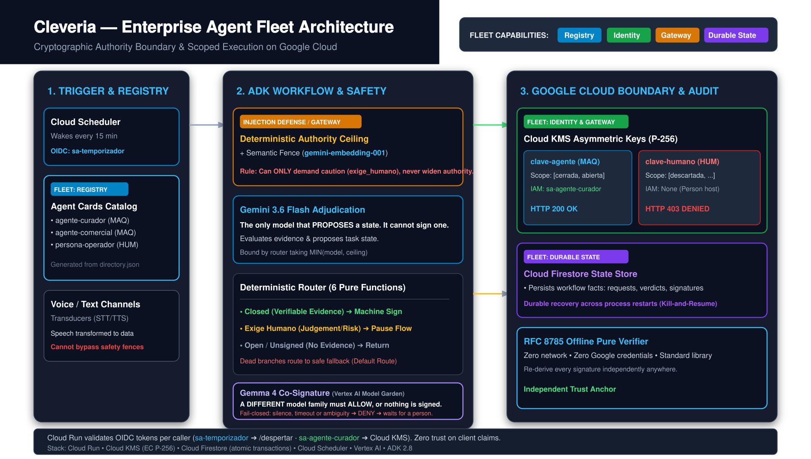
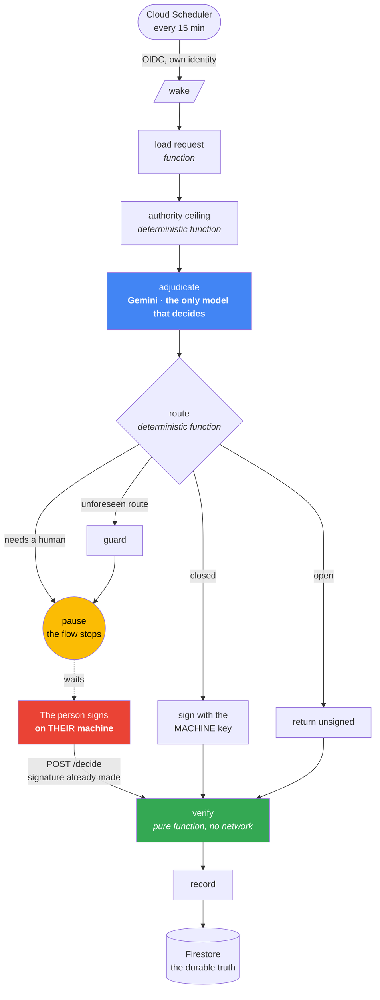

# The Signing Lock

**An agent that closes tasks and cannot sign as a human.** Not because it shouldn't — because it
can't. The key that authorises human judgement is out of its reach, and when it tries, the cloud
says no.

**Four Google models take part. Exactly one of them decides.** Counting models is not counting
who decides, and here that distinction is the architecture:

| Model | What it does | Can it widen the machine's authority? |
|---|---|---|
| Gemini 3.6 Flash | **adjudicates** — the one judgement call in the flow | no: a function takes the *minimum* of its verdict and the ceiling |
| `gemini-embedding-001` | semantic fence: catches judgement written to dodge the keyword list | **no — it can only ask for *more* caution** |
| Speech-to-Text | transducer: turns a voice note into words | no. It is not on the decision path; it is before it |
| Text-to-Speech | transducer: turns the answer into speech | no |

**No model here can grant itself authority.** Authority comes from a deterministic function and
from which key IAM will let you touch. So a model that fails, hallucinates or is poisoned opens
no door: at worst it bothers a person unnecessarily. A transcript is *data*, exactly like typed
text — if a voice note contains instructions aimed at the agent, they stay data, and they stay a
signal that a human is needed.

**Two agents and a person** — not three agents. The distinction is the whole point: if the person
were just another agent, the human/machine boundary would blur exactly where this project claims
to defend it. Three separate keys, three different scopes, three different IAM principals, and
the cloud refuses twice over: an agent cannot sign as the person, **and one agent cannot sign as
another agent**.

And it holds when the request arrives **spoken**, not typed: a voice note asking for a judgement
ends up where the same words typed would — with a person. The modality changes; the key does not.

> **Category:** The Fortified Enterprise Fleet · **Organization:** Softronica S.A.S.  
> Spanish version: [`README.md`](README.md). This English version is the authoritative submission doc.

---

## ⚡ Quick Judge Path (Run in 60 Seconds)

```bash
# 1. Zero credentials, zero network offline verification (re-derive all cryptographic signatures)
python3 src/verificar_sobre.py libro/firmas_grafo.jsonl

# 2. Inspect the 2nd Google Model integration (gemini-embedding-001 semantic fence on Vertex AI)
grep -n "gemini-embedding-001" src/cerco_semantico.py
python3 -c "import src.cerco_semantico as c; print(f'Model: {c.MODELO}, Endpoint: Vertex AI {c.REGION}')"

# 3. Run the ADK graph across all test cases (machine signs evidence, pauses on human judgement)
python3 agente/grafo.py

# 4. Inspect generated Fleet Agent Cards (derived deterministically from key directory)
cat agent_cards/catalog.json

# 5. Run the key security & injection kill-tests (bilingual semantic fence & scope gate)
python3 agente/killtest_alcance.py
python3 agente/killtest_inyeccion.py
```



---

## The real defect this comes from

This is not a toy problem. On 26 August 2026, in the system our own team works in — **agents in
preproduction, deliberately not yet in front of customers** — we measured this:

> The function that closes requests signs **"human" by default**, the console exposes no flag to
> declare otherwise, and a model may only write the state "open". **The only way for an agent to
> close a request was to sign as a person.** Result: 58 rows wrongly signed, four of them in the
> state "dismissed" — where the machine absolves itself.

That is an agent-identity failure. This fixes it.

## How it works



**Two models. Neither can grant itself authority. Six functions decide.** Gemini adjudicates;
a second Google model (embeddings) is a semantic fence that may only ask for *more* caution —
it can raise the bar to "a human must decide", never lower it. So if it fails, hallucinates or
is poisoned, no door opens: at worst a person is bothered unnecessarily. Everything deterministic
is a function: cheaper, faster,
and it does not depend on the model reasoning well that day.

### The two keys

| | Machine key | Human key |
|---|---|---|
| Where the private key lives | Cloud KMS, never leaves | Cloud KMS, and **the service cannot reach it** |
| Who may request a signature | only the agent's service account | only the person, from their own machine |
| Which states it may authorise | `closed`, `open` | `closed`, `open`, `dismissed`, `closed_with_judgement`, `waived` |

Scope comes from [`claves/directorio.json`](claves/directorio.json), **not from code**. The
verifier asks a single question: *is this state within the scope of the key that signed?*

## The three things a judge should check

### 1. The machine cannot sign as a human — and the cloud says so

Live, the agent tries to sign with the human key:

```
HTTP 403  PERMISSION_DENIED
Permission 'cloudkms.cryptoKeyVersions.useToSign' denied on resource '…/clave-humano'
```

And the deployed service, asked to sign as a human, answers:

> **"this service cannot sign as a human, and must not"**

The human signature is produced **on the deciding person's machine** and the service only
**verifies** it. It cannot produce one.

### 2. Anyone can re-verify, with no credentials at all

```bash
python3 src/verificar_sobre.py libro/firmas_grafo.jsonl
```

The verifier imports only the standard library and a crypto package. **No network, no Google
account, no credentials.** Signing uses RFC 8785 canonical JSON, so a verifier written in another
language produces the same bytes.

### 3. We measured Google's own injection filter against our attack — it misses

| Prompt | Caught by Model Armor? |
|---|---|
| classic injection, in English | **yes**, high confidence |
| obvious jailbreak, in English | **yes**, high confidence |
| **our attack, in Spanish** | **no** |
| legitimate text | no, as it should |

**The filter works, and our attack still walks through.** That is precisely why the guarantee does
not live in a filter. It lives in a function that does not reason — so there is nothing to
persuade — and in a key the machine cannot reach.

## Run it from scratch

```bash
pip install -r servicio/requirements.txt

gcloud services enable cloudkms.googleapis.com run.googleapis.com \
  firestore.googleapis.com cloudscheduler.googleapis.com aiplatform.googleapis.com
gcloud kms keyrings create firmas --location=us-central1
gcloud kms keys create clave-agente --location=us-central1 --keyring=firmas \
  --purpose=asymmetric-signing --default-algorithm=ec-sign-p256-sha256
gcloud kms keys create clave-humano --location=us-central1 --keyring=firmas \
  --purpose=asymmetric-signing --default-algorithm=ec-sign-p256-sha256
gcloud firestore databases create --location=us-central1 --type=firestore-native

# The separation that holds everything up: the agent may sign ONLY with its own key
gcloud kms keys add-iam-policy-binding clave-agente --location=us-central1 --keyring=firmas \
  --member="serviceAccount:sa-agente-curador@$PROJECT.iam.gserviceaccount.com" \
  --role="roles/cloudkms.signer"
# (nothing is granted on clave-humano — that is the guarantee)

gcloud run deploy candado-firma --source . --region us-central1 \
  --service-account "sa-agente-curador@$PROJECT.iam.gserviceaccount.com" \
  --no-allow-unauthenticated
gcloud scheduler jobs create http despertar-candado --location=us-central1 \
  --schedule="*/15 * * * *" --uri="$URL/despertar" --http-method=POST \
  --oidc-service-account-email="sa-temporizador@$PROJECT.iam.gserviceaccount.com" \
  --oidc-token-audience="$URL"
```

Locally, without deploying anything:

```bash
python3 agente/grafo.py                                   # the whole graph, three sample requests
python3 src/verificar_sobre.py libro/firmas_grafo.jsonl   # verify with no credentials
python3 src/decidir_como_persona.py PET-002 descartada    # the person decides and signs
```

**English and Spanish both work.** The agent adjudicates in either language, and the authority
ceiling recognises judgement markers in both — an English-only gap we found and closed, with the
measurement in the commit history.

## The tests that close it

```bash
python3 agente/killtest_inyeccion.py     # poisoned text vs the authority ceiling (8 cases, 2 languages)
python3 agente/killtest_alcance.py       # per-key scope, with real signatures
python3 agente/killtest_canonico.py      # signer and verifier produce identical bytes
python3 agente/killtest_blindaje.py      # does the vendor's filter catch OUR attack?
python3 agente/killtest_durabilidad.py   # the pause survives process death (5 steps, 5 processes)
```

## The promise, stated precisely

Over-promising is worth nothing, so it is kept separate:

| **Guaranteed**, no matter what | Only **mitigated** |
|---|---|
| The machine **cannot** produce a signature that validates as human. Cryptography, not trust. | That the machine won't close a case a human would have wanted to see. |
| No key can authorise a state outside its scope. | Rests on the text ceiling and the vendor filter — both heuristics. |
| Every closure is **attributable and non-repudiable**, checkable by anyone with the public key. | |
| The verifier needs **no credentials, no network, no Google account**. | |

**Whoever controls `claves/directorio.json` controls who counts as human.** That is why it lives
in the repository and not in a database: every change is in the history, with its author and date.

## Fleet Capabilities Coverage

Following official guidance for *The Fortified Enterprise Fleet* (where first-party equivalents are accepted):

| Fleet Subsystem | Cleveria First-Party Equivalent | Live Demonstration |
|---|---|---|
| **Agent Registry** | Versioned Agent Cards (`agent_cards/catalog.json`) generated directly from `claves/directorio.json` | Generated deterministically via `generar_agent_cards.py` |
| **Agent Identity** | Cloud KMS asymmetric keys with individual IAM Service Accounts per agent | Real HTTP 403 when machine attempts to sign as human |
| **Gateway / Policy** | Deterministic scope gate enforcing state limits per key | Rejected out-of-scope transitions via `killtest_alcance.py` |
| **Durable State / Memory** | Cloud Firestore native persistence for workflow facts | Resumable execution surviving process crash (`killtest_durabilidad.py`) |
| **Audit & Trust Anchor** | RFC 8785 canonical JSON signature log + offline zero-credential verifier | `src/verificar_sobre.py` independently verifiable without cloud access |
| **Injection Defense** | Multilingual semantic fence (`gemini-embedding-001`) + deterministic keyword ceiling | Catches 9/9 adversarial injections (`killtest_cerco_semantico.py`) |

## What is declared absent (by design)

Declaring a component absent is honest engineering:

- **Agent Gateway as a separate proxy product**: Not built; replaced by direct cryptographic scope verification.
- **Conversational Memory Bank / Vector DB**: Not built; workflow continuity relies on durable domain facts in Firestore, not probabilistic memory.
- **Passkeys for human authentication**: Planned; currently signed via operator workstation key.

## How it was built

Every decision was attacked by an external model **before** being written, and several found real
faults that are fixed in the history: a route with no edge that killed the flow silently, a resume
flag that did not reach where we thought, a rigid schema that turned a bad model answer into a
crash, two canonical serialisers that disagreed with each other, an authorisation header read
case-sensitively that left the door wide open, and an authority ceiling that only spoke Spanish.

It is all in the commit messages, with dates and measurements.

**The clearest example, and it is the semantic fence.** We built it, then handed it to an external
attacker whose only job was to get judgement past it. **It broke nine times out of nine** —
notarial Spanish, English accounting jargon, French, Chinese, and absolution buried in ISO/ERP
filler; eight of those nine also walked past the keyword ceiling. We fixed it three ways —
multilingual embeddings, per-sentence scoring so filler stops diluting the signal, and anchors in
the register and languages of the attack — and **it now catches nine out of nine**. Those nine
texts are checked into the repository as a permanent adversarial bank (`agente/banco_adversarial.py`)
that only ever grows.

**That happened before we shipped, not after.** And we still publish what it cannot do: two
legitimate closures trip it, and they are irreducible — by meaning alone you cannot separate
"balance zero because a duplicate charge was reversed" from "balance zero because we forgave it".
The cause is not in the text. Tuning the threshold until that looked solved would be fabricating a
number against our own test set. **The fence is a net, not a guarantee. The guarantee is the key
the service does not have.**
