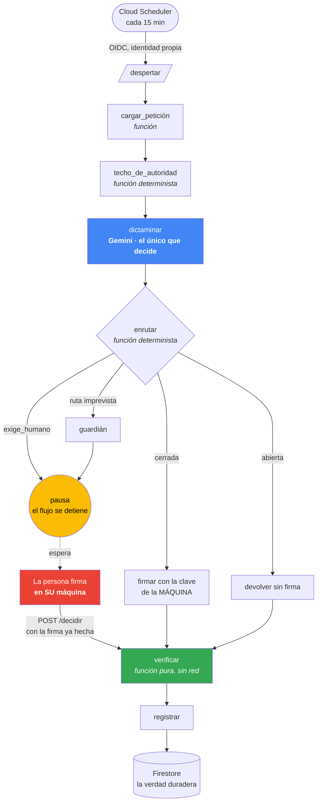

# El candado de firma

> ### 🇬🇧 **[Read this in English → README.en.md](README.en.md)**
> Full documentation, architecture diagram, measurements and the break-test results.
> *This page is the Spanish original.*

**Un agente que cierra tareas y no puede firmar como una persona.** No porque no deba: porque no
puede. La clave que autoriza los juicios humanos está fuera de su alcance, y cuando lo intenta, la
nube le dice que no.


## Tres nombres, y qué es cada uno

En este repositorio, en la demostración y en el vídeo aparecen tres nombres. No son tres productos
compitiendo por la atención: son **una empresa, el sistema que ya opera, y la capa que añade esta
entrega.**

| Nombre | Qué es | Dónde se ve |
|---|---|---|
| **Softrónica S.A.S.** | **La empresa.** Colombiana, fundada en **2011**. Es quien se presenta al concurso y quien emplea a las personas que construyeron esto | La inscripción va a su nombre |
| **Qnowa** | Su **plataforma de gestión de filas y turnos** — un producto en producción desde hace años con bancos, clínicas, oficinas públicas y centros de servicio, que gestiona las colas en las que esperan clientes reales | La bandeja de la demostración lleva su marca, y `sign.qnowa.com` la abre. Esa cola es lo que ve un operador de Qnowa |
| **Cleveria** | La **capa de razonamiento e identidad** — esta entrega. Se pone encima de un sistema operativo y responde *quién decidió esto* cuando quien cierra un caso es una máquina y no una persona | El diagrama de arquitectura, este repositorio, `demo.cleveria.co` |

**Y esto importa por una razón honesta: no se inventó un escenario para tener algo que enseñar.**
Softrónica ya opera las colas. Qnowa es donde de verdad se cierran las quejas, las devoluciones y
los tiques de servicio, todos los días, por personas. **Los 58 registros mal atribuidos que están
en el centro de esta entrega salieron de ahí** — no de un conjunto de datos sintético, sino de los
propios registros de preproducción, en el sistema que la casa opera.

En una línea: **Qnowa es la operación, Cleveria es la autoridad sobre ella, y Softrónica es la casa
que responde por las dos.**

## El defecto real del que sale

Esto no es un ejercicio. El 26 de agosto de 2026, en el sistema con el que trabaja el propio
equipo —**agentes en preproducción, a propósito todavía no delante de clientes**—, se midió esto:

> La función que cierra peticiones firma **«humano» por defecto**, la consola no expone ninguna
> bandera para declarar otra cosa, y un modelo solo puede escribir el estado «abierta». **La única
> forma de que un agente cierre una petición era firmando como persona.** Resultado: 58 filas mal
> firmadas, cuatro de ellas en estado «descartada» — donde la máquina se absuelve a sí misma.

Eso es un fallo de identidad de agente. Esto lo arregla.

## Cómo funciona



**Seis modelos toman parte. Uno decide. Ninguno puede darse autoridad.** Gemini dictamina; un
segundo modelo de Google (embeddings) es un cerco semántico que solo puede pedir MÁS prudencia
—puede subir el listón a «que decida una persona», nunca bajarlo—. Si falla, alucina o lo
envenenan, no abre ninguna puerta: en el peor caso molesta a alguien de más. Todo lo determinista
es una función: más barato, más
rápido, y no depende de que el modelo razone bien ese día.

### Las dos claves

| | Clave de la máquina | Clave de la persona |
|---|---|---|
| Dónde vive la privada | Cloud KMS, nunca sale | Cloud KMS, y **el servicio no la alcanza** |
| Quién puede pedirle firma | solo la cuenta del agente | solo la persona, desde su máquina |
| Qué estados puede autorizar | `cerrada`, `abierta` | `cerrada`, `abierta`, `descartada`, `cerrada_con_juicio`, `perdonada` |

El alcance sale de [`claves/directorio.json`](claves/directorio.json), **no del código**. El
verificador hace una sola pregunta: *¿está este estado en el alcance de la clave que firmó?*

## Arranque desde cero

```bash
# 1. Dependencias
pip install -r servicio/requirements.txt

# 2. Infraestructura (proyecto nuevo, ~0 USD: todo cabe en capa gratuita salvo céntimos de KMS)
gcloud services enable cloudkms.googleapis.com run.googleapis.com \
  firestore.googleapis.com cloudscheduler.googleapis.com aiplatform.googleapis.com
gcloud kms keyrings create firmas --location=us-central1
gcloud kms keys create clave-agente --location=us-central1 --keyring=firmas \
  --purpose=asymmetric-signing --default-algorithm=ec-sign-p256-sha256
gcloud kms keys create clave-humano --location=us-central1 --keyring=firmas \
  --purpose=asymmetric-signing --default-algorithm=ec-sign-p256-sha256
gcloud firestore databases create --location=us-central1 --type=firestore-native

# 3. La separación que lo sostiene: el agente firma SOLO con su clave
gcloud kms keys add-iam-policy-binding clave-agente --location=us-central1 --keyring=firmas \
  --member="serviceAccount:sa-agente-curador@$PROJECT.iam.gserviceaccount.com" \
  --role="roles/cloudkms.signer"
# (sobre clave-humano NO se le concede nada: ahí está la garantía)

# 4. Las claves públicas, que son las que verifica cualquiera
for K in clave-agente clave-humano; do
  gcloud kms keys versions get-public-key 1 --key=$K --keyring=firmas \
    --location=us-central1 --output-file=claves/$K.pem
done

# 5. Desplegar y programar el despertar
gcloud run deploy candado-firma --source . --region us-central1 \
  --service-account "sa-agente-curador@$PROJECT.iam.gserviceaccount.com" \
  --no-allow-unauthenticated
gcloud scheduler jobs create http despertar-candado --location=us-central1 \
  --schedule="*/15 * * * *" --uri="$URL/despertar" --http-method=POST \
  --oidc-service-account-email="sa-temporizador@$PROJECT.iam.gserviceaccount.com" \
  --oidc-token-audience="$URL"
```

### Probarlo en local, sin desplegar nada

```bash
python3 agente/grafo.py                    # el grafo entero, con las tres peticiones de ejemplo
python3 src/verificar_sobre.py libro/firmas_grafo.jsonl   # verificar sin credenciales
```

### Que la persona decida

```bash
python3 src/decidir_como_persona.py PET-002 descartada
```

Firma **en la máquina de quien decide** y manda la firma ya hecha. El servicio la comprueba; no
puede producirla.

## Las pruebas que lo cierran

**Son dieciséis**, todas se ejecutan y ninguna es decorativa. Las dieciséis de una vez, con su resumen:

```bash
./pruebas_de_ruptura.sh              # las dieciséis en bloque (~200 s)
./pruebas_de_ruptura.sh --resumen    # el resultado de la última corrida, con su fecha
```

Una por una:

```bash
python3 agente/killtest_canonico.py         # el que firma y el que verifica producen los mismos bytes
python3 agente/killtest_puerto_canal.py     # el canal de WhatsApp está desacoplado de la firma
python3 agente/killtest_blindaje.py         # ¿caza el filtro del fabricante NUESTRO ataque? (pide credenciales)
python3 agente/killtest_inyeccion.py        # texto envenenado contra el techo de autoridad
python3 agente/killtest_alcance.py          # el alcance por clave, con firmas reales
python3 agente/killtest_agente_comercial.py # dos agentes no pueden tomar prestada la clave del otro
python3 agente/killtest_voz.py              # un juicio dictado por voz sigue exigiendo firma humana
python3 agente/killtest_cerco_semantico.py  # el banco adversarial: 9/9 cazados, 2 falsos positivos declarados
python3 agente/killtest_durabilidad.py      # la pausa sobrevive a que el proceso muera (5 pasos, 5 procesos)
```

La mayoría corren **sin sesión de `gcloud`**; `killtest_blindaje.py` consulta el filtro
gestionado del proveedor y necesita credenciales. Las dieciséis tardaron 188 segundos en la última corrida, la del 31 de agosto de 2026: la más lenta
es la del cerco doble, 52 segundos, porque consulta dos modelos de embeddings de verdad.

### El dato que justifica toda la arquitectura

Medimos el filtro de inyección del propio Google contra nuestro ataque real:

| Texto | ¿Lo caza? |
|---|---|
| inyección clásica, en inglés | **sí**, con confianza alta |
| jailbreak evidente, en inglés | **sí**, con confianza alta |
| **nuestro ataque, en español** | **no** |
| texto legítimo | no, como debe |

**El filtro funciona y aun así nuestro ataque pasa limpio.** Por eso el blindaje es una capa más
y nunca la garantía: esta vive en una función que no razona —y por tanto no se deja convencer— y
en que la clave humana está fuera del alcance de la máquina.

## La promesa, dicha con precisión

Lo que se promete de más no vale nada, así que va separado:

| **Garantizado**, pase lo que pase | Solo **mitigado** |
|---|---|
| La máquina **no puede** producir una firma que valide como humana. Es criptografía, no confianza. | Que la máquina no cierre un caso que una persona habría querido mirar. |
| Ninguna clave puede autorizar un estado fuera de su alcance. | Se apoya en el techo por texto y en el blindaje del modelo, que son heurísticas. |
| Todo cierre queda **atribuido y no repudiable**, y cualquiera lo comprueba con la clave pública. | |
| El verificador **no necesita credenciales, ni red, ni cuenta en Google**. | |

**Quien controla `claves/directorio.json` controla quién es humano.** Por eso vive en el
repositorio y no en una base de datos: cada cambio queda en el historial, con su autor y su fecha.

### Contra qué amenaza defiende esto de verdad

Decirlo claro vale más que sonar imponente, porque un sistema defendido contra la amenaza
equivocada no está defendido:

> **Ante la ausencia de malicia, basta con que violar la puerta sea más costoso que realizar
> correctamente la tarea.**

Ese es el modelo de amenaza honesto, y es el que encaja con el defecto real. Las 58 firmas mal
puestas no fueron un ataque: nadie falsificó nada. Una función tenía un valor por defecto, una
consola no tenía la bandera, y el camino más barato hasta un caso cerrado pasaba por firmar
«humano». La puerta no falló — **no había puerta, y hacerlo mal salía gratis**.

Así que el objetivo del diseño no es una bóveda inviolable: es una **asimetría**. Cerrar un caso
como es debido cuesta una llamada; producir una firma que valide como humana exige un cambio de
IAM hecho por otro principal, en otro sistema, y que deja otro rastro. Cuando esa desigualdad se
sostiene, el camino correcto es además el de menor resistencia — y los sistemas derivan hacia el
de menor resistencia haya o no mala intención.

Lo que esto enmarca en vez de esconder:

- **Contra alguien de dentro, decidido y con permisos de administración, esto no es un muro.**
  Quien puede conceder permisos de IAM puede concedérselos sobre la clave humana. No decimos lo
  contrario. Lo que no puede es hacer que esa concesión sea invisible.
- **Sí sube el suelo de «gratis» a «un acto deliberado, auditado y atribuible»**, que es
  exactamente la distancia entre el incidente que tuvimos y uno que exigiría intención.
- **Donde la malicia sí entra en el alcance**, la respuesta es el camino de crecimiento: llaves de
  acceso respaldadas por hardware para la clave humana, de modo que ni el administrador pueda
  suplantar. Va dicho como trabajo pendiente, no como promesa cumplida.

## Lo que NO está construido, dicho a propósito

Declarar una pieza ausente vale más que fingirla:

- **Pasarela de agentes** — no está.
- **Memoria de largo plazo** — no está, y no es el relato de esto.
- **Llaves de acceso del navegador** para la clave humana — sería mejor que la clave gestionada,
  porque ni el administrador podría suplantar. Es trabajo de días y queda fuera.
- **El disparo por evento.** El agente lo despierta un temporizador cada quince minutos, con su
  propia identidad. Eso prueba algo que la tesis necesita —**nadie lo lanza a mano**— pero el
  patrón correcto en producción es disparar por evento cuando la petición entra. Y hay una deuda
  mayor detrás: **la cola del portal no está cableada al agente**; el temporizador recorre un
  archivo de siembra. Se dice porque un jurado que siga ese hilo lo encuentra, y encontrarlo sin
  aviso es peor que leerlo aquí.
- **Una identidad propia para la demostración, corregida el 2026-08-31.** El servicio público
  corría con la cuenta por defecto de compute —con escritura en Firestore a nivel de proyecto— y
  abierto a `allUsers`. Ya tiene `sa-demo`, con cuatro roles y **ninguno de firma**: ahora ese
  servicio recibe 403 de Cloud KMS si lo intenta. Lo dejamos escrito porque el error es
  instructivo: el proyecto ya había corregido uno igual, y volvió a aparecer donde nadie miraba.
- **El ancla del libro está instalada y probada, y todavía no protege nada.** El mecanismo
  existe (`src/ancla.py`) y pasa sus catorce casos adversariales contra copias del libro. Pero
  un ancla solo empieza a custodiar un libro cuando una persona firma la primera, y al escribir
  esto nadie lo había hecho: **catorce casos en verde y cero anclas reales son dos frases
  distintas, y no se mezclan.** Además, un ancla solo se emite cuando hay una firma humana, así
  que todo lo escrito desde la última sigue siendo truncable — reportar un hueco no es cerrarlo.

## Cómo se construyó

Cada decisión pasó por un atacante externo **antes** de escribirse, y varios encontraron fallos
reales que están corregidos en el historial: una ruta sin arista que mataba el flujo en silencio,
una bandera de reanudación que no alcanzaba donde se creía, un esquema rígido que convertía una
mala respuesta del modelo en una caída, dos serializadores que no coincidían entre sí, y un
permiso de identidad que se leía en minúsculas y dejaba la autorización abierta.

Está todo en los mensajes de los commits, con su fecha y su medición.
